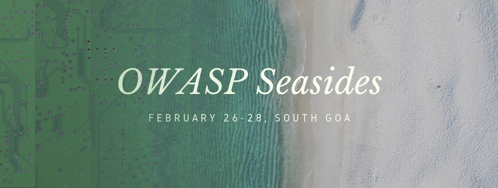

# About OWASP Seasides

Welcome to the Annual OWASP SeaSides InfoSec event. Welcome to the Annual OWASP SeaSides InfoSec event.

Through OWASP [Bangalore chapter](https://www.owasp.org/index.php/Bangalore) we aim to provide free of cost premium workshops and talks to all the participants. We plan to have Workshop on **26th to 28th Feb \(9:00 AM to 5:00 PM\)** and Beach-side talks in the Evening from on **27th Feb and 28th Feb \(7:00 PM to 10:00 PM\).** Mega beach side party on **2nd March**.

[nullcon](https://nullcon.net/website/) has been doing a great job getting researchers from all over the world to India. If you are coming for [nullcon 2019](https://nullcon.net/website/) then we are giving you more reasons to come early and participate in [OWASP](https://www.owasp.org/index.php/Main_Page) and [null ](https://null.co.in/)community events.

If you want to be part of event and speak at the events then please fill the CFP/CFT form.

