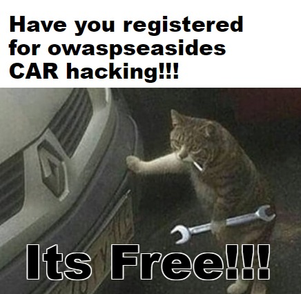

# Reversing and Exploitation of Vehicle \(CAR Hacking\)

**Abstract**

Today all vehicles are connected through V2X technologies. All manufacturers are coming with new technologies which can be added technologies for Vehicle industries like Fleet management systems, diagnosis toolset etc. These systems are from third-party vendors which are still in the vulnerable state. So addressing their weaknesses requires specific skillset in cybersecurity of vehicle industries. In this course will provide real CAR  to get Hands On the experience of CAR and their component security testing. "Reversing and exploitation of Vehicle" course targeted from Basic level to advance level. During course will provide Virtual machine which has an all necessary toolkit which can be used after training for Vehicle security testing.

* **Introduction of Vehicle \(Vehicle network\)**

  * Briefing of ECU
  * Briefing of Vehicle Protocols
  * Understanding and briefing CANBUS protocol
  * Briefing of CANBUS frame
  * Briefing of CAR hacking Tools
  * Eavesdropping of Canbus messages
  * Reverse Engineering of CANBUS
  * Identify the Arbitration ID of a specific vehicle event
  * Attacks on cluster
  * Replay attacks
  * Sending Forged CANBUS messages
  * DOS Attack on CANBUS network

* **Key fobs** 

  * Introduction
  * Recon of Key fobs frequency
  * Reverse engineering of Key fob data
  * Sending malformed key fobs request
  * Jamming at RX and TX
  * Defeating encoding mechanism
  * Replay Attack
  * Attack on key fob
  * Cloning of Key fobs

* **Infotainment**
  * USB
  * Fuzzing on USB stack 
  * USB interception for software update

**About Trainer**

**Arun Mane**

Arun is a Hardware, IOT and ICS Security Researcher. His areas of interest are Hardware Security, SCADA,Automotive security, Fault Injection, RF protocols and Firmware Reverse Engineering. He also has experience in performing Security Audits for both Government and private clients. He has presented a talk at the nullcon 2016,2017,2018 Goa, GNUnify 2017, Defcamp 2017, 2018 Romania, BsidesDelhi 2017, c0c0n x 2017, EFY 2018, x33fcon2018, BlackHat USA 2018, Defcon USA 2018 Also Trainer for Practical Industrial Control Systems \(ICS\) hacking training, delivered in x33fcon2018, HIP 2018 and also delivered training for IoT hacking in HITB 2017, HIP 2017, BlackHat Asia 2018 and private clients in London, Australia, Sweden, Netherlands etc. He is an active member of null open community.   

\*Note: Registration details will be shared with Trainers and Sponsors

**The registration is closed. However, all the events and workshops are on first come first serve basis. Please reach the venue early to grab your spot.**



