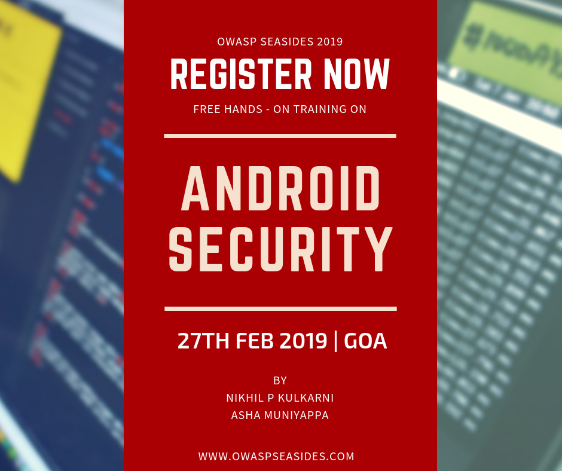

# Mobile App Security

## First Half - 27th February 2019 \(9AM - 1PM\) ****

**Android App Security Workshop** 

Android Application Penetration Testing Training is intended for students/professionals who are interested to make career in Mobile application penetration testing domain. It involves decompiling, real-time analysing and testing android application from security point of view. This training covers understanding the internals of android app, Real-time testing of android applications and some OWASP Mobile Top-10 security issues like Insecure logging, Unintended data leakage, Insecure communication, Insufficient cryptography, Insecure authentication and Poor code quality.

**WHO THIS TRAINING IS FOR** 

* Students interested in Mobile Security 
* Security Analysts/Researchers.
* IT Professionals working in Android Development domain
* IT professionals working in Information Technology-Security domain.

**KEY TAKEAWAYS** 

* A detailed understanding of the Android Application internals 
* A clear understanding of the Android Application Penetration Testing
* Ability to analyse an Android Application from a Security Standpoint 
* Understanding of multiple security tools to be used for Mobile Pentesting

**DELIVERABLES**  

* Training Slides 
* Custom made VM’s 
* Updated Toolset of softwares/applications used for Mobile Pentesting

**REQUIREMENTS**

* Laptop with minimum 30 GB Hard Disk Space & 6GB RAM with administrative privileges 
* Updated Virtual-box installed
* 2 Functional USB Ports

**TABLE OF CONTENT**

* Introduction to Android 
* Android Security Architecture 
* Android Permission Model 
* Application Sandboxing 
* Setting up Mobile Pentest Environment 
* Android Application Architecture 
* Reverse Engineering 
* Bypassing Android Permissions 
* Dynamic and static analysis of the application 
* Insecure Data Storage 
* Insecure Communication 
* Insufficient Cryptography 
* Insecure Authentication 
* Poor Code Quality

**About Trainers**

**Trainer 1: Nikhil P K** is a Security Researcher and an International Security Trainer. His area of interest includes Web Application Penetration Testing, Mobile Application Security and Machine Learning. He has presented his talks at International and National level Conferences and meets such as Nuit Du Hack Paris, OWASP AppSec, Cocon International Cyber Policing and Security Conference, DEFCON Bangalore Chapter, Null Open Security Meet Bangalore, Null Open Security Meet Mysore. He is also a Bug Bounty Hunter and has been listed and Acknowledged in the Hall Of Fames of Companies such as Microsoft, Apple, Adobe, Nokia, Engine Yard and AVIRA Antivirus.

**Trainer 2: Asha Muniyappa** is a Mobile application security researcher. She is a CEH certified professional and is responsible for innovating the mobile app security assets to ensure secure delivery of mobile apps. Her expertise is in Application Security, with key research areas of interest including Mobile Apps, Hacking. She is passionate to learn new techniques for attacking mobile apps and have been researching on performing attack simulations on the apps to determine and exploit security flaws.

## Second Half  - 27th February 2019 \(2PM - 6PM\)

**Modern iOS App Pentesting And Security for Fun and Profit**

Is your product or application has a mobile app? Do you use any of AWS services? Are your product security engineers working on mobile application security? Looking for information about the importance of mobile app security? If your answer is yes to any of these questions, then this talk is for you!

This hands-on session will discuss recent case studies of critical findings in iOS apps and also help to address important issues as encryption key management, authentication issues along with OWASP Top 10 for Mobile \(iOS\). This training will focus on Pentesting both Objective C and Swift iOS Applications.

**Pre-requisites**

* Macbook with Xcode \(10.1\) Installed
* Docker Installed

**Training Contents \(not limited to\)**

* Introduction to iOS App Security
* iOS Bug Bounty Case Studies
* iOS Pentesting Lab Setup
* Approach for Objective C and Swift App Pentesting
* Reverse Engineering and Binary Analysis
* Exploiting iOS Local Data Storage
* Exploiting Broken Cryptography
* Exploiting Cloud Misconfigurations
* Runtime Analysis of iOS Apps
* Frida for iOS Pentesting
* Analyzing iOS Network Traffic
* iOS Secure Coding
* iOS CTF

**WHO SHOULD ATTEND?**

* Security Professionals
* Mobile Application Pentesters
* Bug Bounty Hunters
* iOS Application Developers
* Security Architects
* People interested to start into Mobile security

**Key Takeaways**

* End to end iOS App Pentesting
* iOS Secure Coding
* iOS reverse engineering, runtime analysis
* Encryption key management, Defending crypto attacks
* Designing secure iOS applications

**About Trainers**

**Trainer 3: Swaroop Yermalkar** works as Lead Security Engineer and has authored the popular book “Learning iOS Pentesting” \([https://goo.gl/T8jvjJ](https://goo.gl/T8jvjJ)\). Swaroop also lead an open source project - OWASP iGoat \([https://igoatapp.com/](https://igoatapp.com/)\) which is developed for mobile security. He is one of the top bug bounty researchers worldwide, working with Cobalt.io \([https://app.cobalt.io/swaroopsy](https://app.cobalt.io/swaroopsy)\), Synack.inc. ****He has given talks and workshops at many security conferences including AppSec Israel, AppSec USA 2018, BruCON, SEC-T, EuropeanSec, Hacks in Taiwan \(HITCON\), GroundZero, c0c0n, 0x90, GNUnify. You can reach out to Swaroop at [@swaroopsy](https://twitter.com/swaroopsy).

**Trainer 4: Shilpa Ranganatha** is an iOS  application security researcher. She is a CEH certified professional and is responsible for innovating the mobile app security assets to ensure secure delivery of mobile apps. She is keen to expand her horizons and constantly strives to find zero-day vulnerabilities in client  applications.

\*Note: Registration details will be shared with Trainers and Sponsors

**It's mandatory register your spot in advance as we need to organise the seating logistics. Please fill below form to register.**



