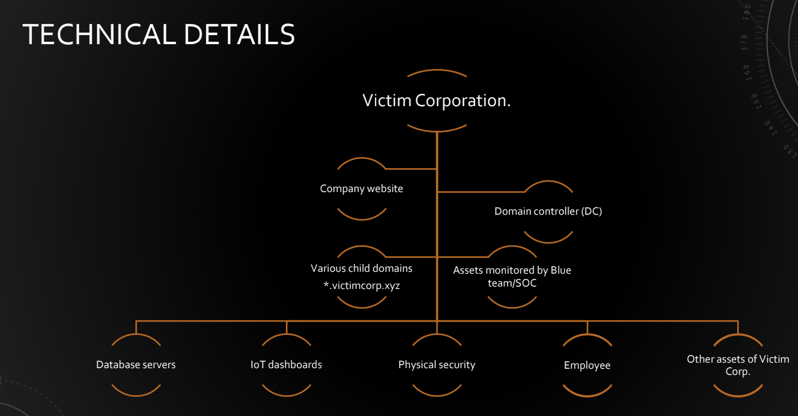
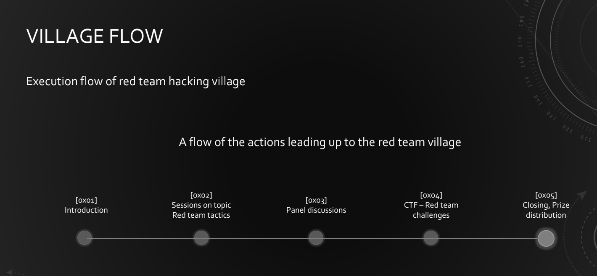

# Red Team Village

Red Team Village is a community driven combat readiness platform for Red teaming and full scope Cyber security assessments.This community is managed by a group of cyber security and red team tactics enthusiasts. A red teamer needs to be skilled in every aspect of offensive security. We can consider this as a platform to share tactics, techniques, and tools related to various domains of adversarial attack simulation.

We will be conducting workshops, talks, demonstrations, open discussions, Capture the flag challenges and other exercises.

Rather than focusing on Jeopardy type CTF, all our challenges will be based on real time scenarios and infrastructure.The participants needs to red team the targets to get the flags.

**The CTF challenges would be based on red teaming activities and attacks.**

* The participant needs to compromise various levels of infrastructure assets owned by the target corporation. 
* Challenges unlocking a physical safe / locker, by obtaining the locker key stored in the domain admin user folder.
* Final challenge would be, discreetly compromising a corporate asset monitored by Blue team / SOC.

**Innovation**

The primary purpose of the Red Team assessment is to validate your organisations effectiveness against credible and realistic cyber threats. Threats are real and it makes the organisations to concentrate on full scope adversarial attack simulation engagements.

* Red team village is one of it's kind. Our end goal is to act as a platform form red team tactics knowledge sharing and exercises. 
* We keep creating real world scenarios and challenges for our events. 
* We're planning to create a permanent Red team related CTF platform which contains all of our previous challenges, where the red team enthusiasts can join and participate in real time challenges and learn new attack vectors, techniques etc.
* Also we organise combined exercises which includes both red team and blue team. So that tactics can be shared and helps to create a Purple team structure.

**TECHNICAL DETAILS – CTF CHALLENGES**

There is a target company named Victim Corporation. Victim Corp has a wide list of assets.

* The assets can be Digital, Physical or even Employees. 
* The participants needs to attack each assets to get flags. 
* There will be Windows Active Directory infrastructure, Linux, IoT, even Phishing campaigns and other attack frameworks will be there. 
* Digital Lockers and other physical challenges will be introduced. 
* The final challenge would be, attacking a target monitored by Blue team/SOC and get the flags without getting caught in their Radar. 
* Idea is to touch a little bit of everything. OSINT to Post exploitation techniques.

