# Supporters

[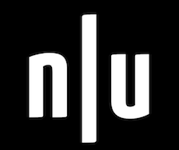](https://null.co.in/)  [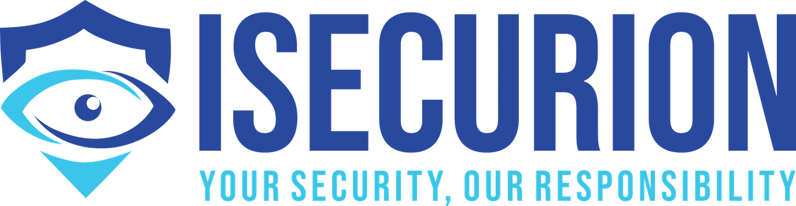](https://isecurion.com/) [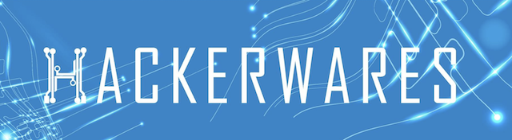](http://hackerwares.in/) [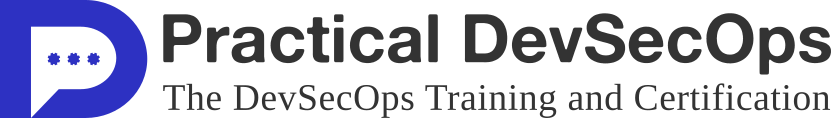](https://www.practical-devsecops.com/) [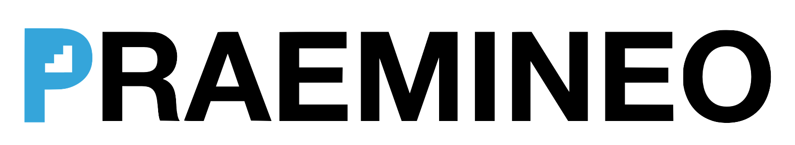](https://praemineo.com)[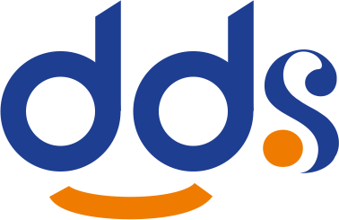](https://www.ddmschool.com) [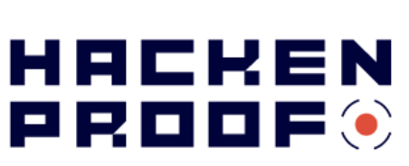](https://hackenproof.com/)[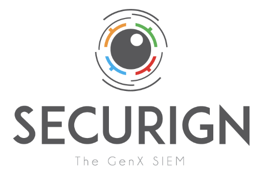](https://securign.com/)  [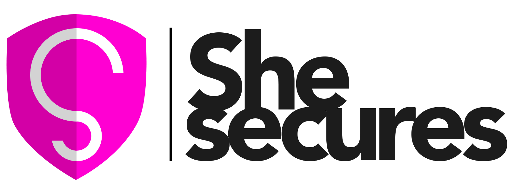](https://shesecures.org/)[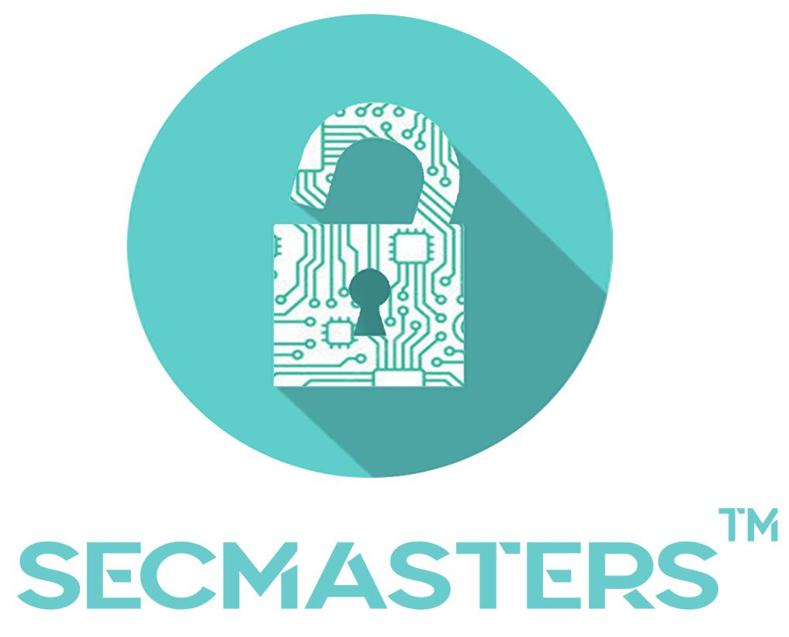](https://www.secmasters.com)[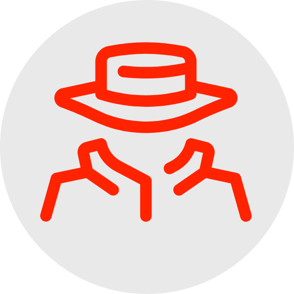](http://pentesto.com)  [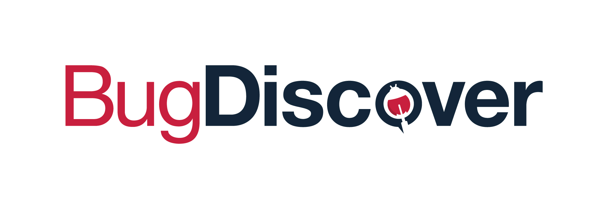](https://www.bugdiscover.com/)

[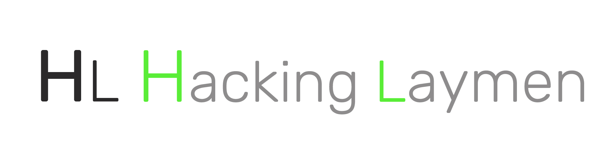](http://hackinglaymen.com)

