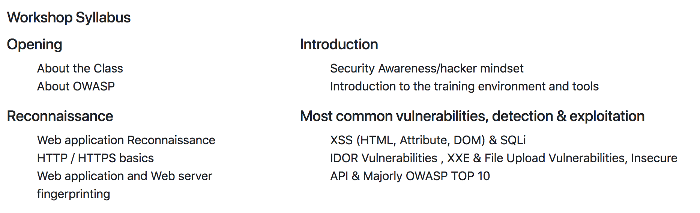

# Penetration Testing Workshop

**Course Abstract**

In this completely hands-on workshop, you would get to understand the techniques and methodologies that could be applied when performing a web application penetration testing. Throughout this workshop, you would be using Burp Suite tool + OWASP ZAP, which is a conglomerate of distinct tools with powerful features. Apart from gaining familiarity with the tools and the techniques involved in application security testing, you would also get an opportunity to understand some of the common vulnerabilities from the OWASP Top 10 – 2017 list. We would provide you with a vulnerable website, and you would uncover security issues in it even if you have never done this before!

**Targeted Audience :** Women Hackers

**Upon Completion of this training, attendees will know:** 

* Scope a security review and priorities the work. 
* Understand the manual and automated tools and techniques available and when to apply them.
* Understanding of DevSecOps including Agile Framework. 
* Gain confidence in customising your Web Application Security Testing approach to suit application-specific pen-testing needs, by gaining clarity on the powerful features provided by the Burp Suite tool.
* A Lots of hands-on web application hacking labs and exercises along with core concepts of web application security.

**Attendees should bring:**

* Laptop with administrator access \(mandatory\)
* Minimum 4 GB RAM
* At least 10 GB of free hard disk space.
* Oracle VirtualBox 5.x or later installed.

**Prerequisites for attendees:**

This is an introductory training for web application developers, students, including those new to application security. The course has been developed to train learners at all levels.

**Trainers:** 

* \*\*\*\*[Vandana Verma](https://twitter.com/infosecVandana)
* [Geeta Handa](https://twitter.com/handa_geeta)


